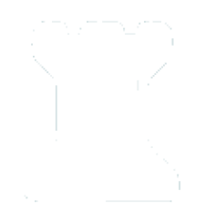

<!-- PROJECT LOGO -->
 

  

  <h1 align="center">Chezzle</h1>

  <h3 align="center">
    A chess website featuring over 3,000,000 unique puzzles
     
     
    <a href="https://chezzle.onrender.com/"><strong>https://chezzle.onrender.com</strong></a>
  </h3>

<!-- ABOUT THE PROJECT -->
## About The Project

  

- The motivation behind this project was simple: I wanted to enhance my chess abilities through practice and problem-solving. As an avid chess enthusiast, I realized that solving puzzles is an excellent way to sharpen one's skills, improve tactical vision, and deepen one's understanding of the game.

- However, I encountered a common obstacle while trying to access chess puzzles. Popular chess platforms like Chess.com offer a limited number of free puzzles each day, and I craved a more diverse and extensive collection to challenge myself with.

- To overcome this challenge and create a solution for chess enthusiasts like me, I embarked on a journey to compile a comprehensive collection of chess puzzles. I scraped the internet and gathered over 3,000,000 unique puzzles from various online sources. This vast assortment covers a wide range of difficulty levels, from beginner to grandmaster, ensuring that there's something for chess players of all skill levels.

## Built With

* 
* 
* 
* 
* 
* 
* 

<!-- ROADMAP -->
## Roadmap

- [x] Create an information tab and information modal
- [ ] Add support for other puzzle categories
  - [ ] Mate in 2
  - [ ] Mate in 3
  - [ ] Pins
  - [ ] Skewers
  - [ ] Forks
- [x] Make it responsive for laptop and large screens
- [ ] Make it mobile responsive
- [ ] Fix the bug with the backward button
- [ ] Add a hint button
- [ ] Redesign the correct/incorrect puzzle counter 

(<a href="#readme-top">back to top</a>)

